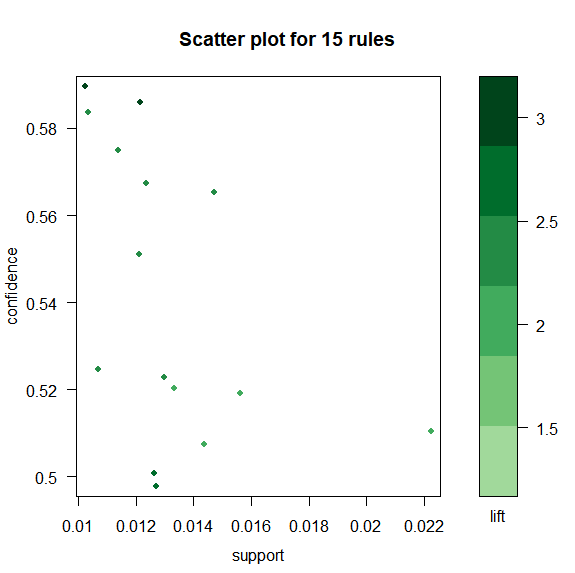
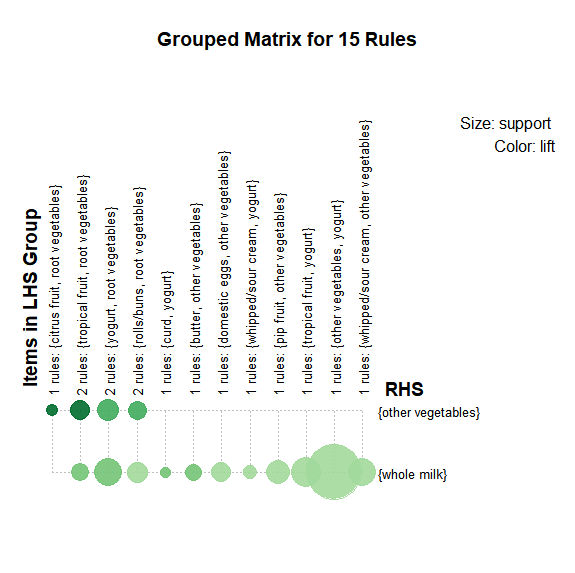
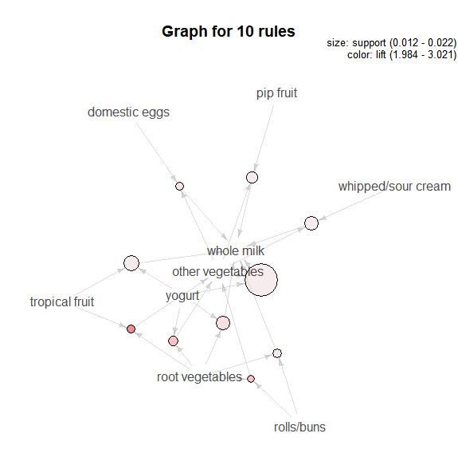

## 关联规则算法

### 基础概念

##### 1. 关联规则的一般形式

项集A、B同时发生的概率称为关联规则的支持度（也称相对支持度）：  
Support（A→B）= P(A∩B)  
项集A发生，则项集B发生的概率为关联规则的置信度：  
Confidence（A→B）= P(B|A）  
##### 2. 最小支持度和最小置信度   

最小支持度是用户或专家定义的衡量支持度的一个阈值，表示项目集在统计意义上的最低重要性；最小置信度是用户或专家定义的衡量置信度的一个國值，表示关联规则的最低可靠性。同时满足最小支持度國值和最小置信度國值的规则称作强规则。
  
##### 3. 项集
项集是项的集合。包含个项的项集称为左项集，如集合{牛奶，麦片，糖}是一个3项集。
项集的出现频率是所有包含项集的事务计数，又称作绝对支持度或支持度计数。如果项集 I 的相对支持度满足预定义的最小支持度阈值，则 I 是频繁项集。  

##### 4. 支持度计数
项集A的支持度计数是事务数据集中包含项集」的事务个数，简称为项集的频率或计数。
已知项集的支持度计数，则规则A→B的支持度和置信度很容易从所有事务计数、项集A和项集A∩B的支持度计数推出：  
Support（A→B）= A、B同时发生的事务个数 / 所有事务个数 = Support_count(A∩B) / Total_count(A)Totalcount(A)

Confidence(A→B）= P(A|B) = Support（A∩B) / Support（A) = Support_count(A∩B) / Support_count(A)

也就是说，一旦得到所有事务个数，A，B和A∩B的支持度计数，就可以导出对应的关联规则 A→B 和 B→A，并可以检查该规则是否是强规则。

* 支持度 Support  支持度是指在所有项集中{X, Y}出现的可能性，即项集中同时含有X和Y的概率. 
* 置信度 Confidence   置信度表示在先决条件X发生的条件下，关联结果Y发生的概率(衡量了所考察的关联规则在“质”上的可靠性)
* 提升度 Lift   表示“使用X的用户中同时使用Y的比例”与“使用Y的用户比例”的比值    
		Lift(X->Y) =Support(X,Y) / Support(X) / Support(Y)  
		...... =frac{Confidence(X,Y)}{Support(Y)}  
		该指标与置信度同样衡量规则的可靠性，可以看作是置信度的一种互补指标

* 出错率 Conviction  Conviction的意义在于度量规则预测错误的概率,表示X出现而Y不出现的概率  
    	Conviction(X->Y)=(1-Support(Y)) / (1-Confidence(X->Y))  

### 规则生成基本流程

一共有2步:

##### 1. 找出频繁项集  

找出所有的频繁项集（支持度必须大于等于给定的最小支持度阈值），在这个过程中连接步和剪枝步互相融合，最终得到最大频繁项集。  

* 扫描数据项，对每个候选项计数，生成候选1-项集C1
* 定义最小支持度阈值为2，从C1生成频繁1-项集L1
* 通过L1xL1生成候选2-项集C2
* 扫描D，对C2里每个项计数，生成频繁2-项集L2
* 计算L3xL3，利用apriori性质：频繁项集的子集必然是频繁的，我们可以删去一部分项，从而得到C3，由C3再经过支持度计数生成L3
* 可见Apriori算法可以分成 **连接，剪枝** 两个步骤不断循环重复

##### 2. 由频繁项集生成关联规则.

n个item,总共可以产生3^n - 2^(n+1) + 1条规则,指定最小置信度来过滤掉弱规则
置信度计算
Confidence(A→B）= P(A|B) = Support（A∩B) / Support（A) = Support_count(A∩B) / Support_count(A)

将这些候选规则与最小置信度阙值相比较,不能满足最小置信度的规则将被消除。

### R语言实现

数据读取

	setwd('xx/xx/arules')
	library(arules)
	library(data.table)
	# --- way1
	gou1 <- read.transactions("./groceries.csv", format="basket", sep=",",skip=0)
	# as(data.table,'transactions') 函数转化 
	# 参数说明：
	# format=c("basket", "single")用于注明源数据的格式。如果源数据每行内容就是一条交易购买的商品列表（类似于一行就是一个购物篮）那么使用basket；如果每行内容是交易号+单个商品，那么使用single。
	# cols=c("transId", "ItemId") 对于single格式，需要指定cols，二元向量（数字或字符串）。如果是字符串，那么文件的第一行是表头（即列名）。第一个元素是交易号的字段名，第二个元素是商品编号的字段名。如果是数字，那么无需表头。对于basket，一般设置为NULL，缺省也是NULL，所以不用指定。
	# signle format的数据格式如下所示，与此同时，需要设定cols=c(1, 2)
	# 1001,Fries
	# 1001,Coffee
	# 1001,Milk
	# 1002,Coffee
	# 1002,Fries
	# rm.duplicates=FALSE：表示对于同一交易，是否需要删除重复的商品

筛选购买两件商品以上的交易  

	groceries_use <- groceries[basketSize > 1]  
	dim(groceries)
	[1] 9835  169  
	dim(groceries_use)  
	[1] 7676  169

每个购物list里包含商品的数量 

	# 每个购物list里包含商品的数量 length in each basket(row) 
	> basketSize<-size(groceries)
	> table(basketSize)
	basketSize
	   1    2    3    4    5    6    7    8    9   10   11   12   13   14   15   16 
	2159 1643 1299 1005  855  645  545  438  350  246  182  117   78   77   55   46 
	  17   18   19   20   21   22   23   24   26   27   28   29   32 
	  29   14   14    9   11    4    6    1    1    1    1    3    1 
	# 单个商品的出现频率 Support of each item 
	> itemFreq <- itemFrequency(groceries)  
	> (head(itemFreq[order(-itemFreq)]))
	      whole milk other vegetables       rolls/buns             soda 
	       0.2555160        0.1934926        0.1839349        0.1743772 
	          yogurt    bottled water 
	       0.1395018        0.1105236

按最小支持度查看

	# itemfreq >= 0.1
	itemFrequencyPlot(groceries, support= quantile(itemFreq,0.9))  

按topn支持度查看

	# head(itemFreq[order(-itemFreq)],10)
	itemFrequencyPlot(groceries, topN=10, horiz=T) 

---
	library(arules) #加载arules程序包
	data(Groceries) #调用数据文件
	Inspect(Groceries) #观看数据集里的数据

	#求频繁项集
	frequentsets=eclat(Groceries,parameter=list(support=0.05,maxlen=10))
	inspect(frequentsets[1:10])
	inspect(sort(frequentsets,by="support")[1:10]) #根据支持度对求得的频繁项集排序并察看
	
	#利用apriori函数提取关联规则
	rules<-apriori(Groceries,parameter=list(support=0.01,confidence=0.5))

	#规则查看
	Inspect(rules)
	#Actionable 这些rule提供了非常清晰、有用的洞察，可以直接应用在业务上

##### 1. 如何发现有用的rule

1. 按照 lift 对规则进行排序  

		ordered_groceryrules <- sort(rules, by="lift")
		inspect(ordered_groceryrules[1:5])

	其中 lift 是一个类似相关系数的指标。lift=1时表示L和R独立。这个数越大，越表明L和R存在在一个购物篮中不是偶然现象。

2. 规则搜索

		yogurtrules <- subset(rules, items %in% c("yogurt")) 
		inspect(yogurtrules[1:3])

	items %in% c("A", "B")表示 lhs+rhs的项集的并集中，至少有一个item是在c("A", "B")  item = A or item = B
	如果仅仅想搜索lhs或者rhs，那么用lhs或rhs替换items即可。如：lhs %in% c("yogurt")  
	%in%是精确匹配  
	%pin%是部分匹配，也就是说只要item like '%A%' or item like '%B%'  
	%ain%是完全匹配，也就是说itemset has ’A' and itemset has ‘B'  

3. 通过 条件运算符(&, |, !) 添加 support, confidence, lift的过滤条件

		fruitrules <- subset(rules, items %pin% c("fruit")) 	
		byrules <- subset(rules, items %ain% c("berries"))
		fruitrules <- subset(rules, items %pin% c("fruit") & lift > 2)
		x=subset(rules,subset=rhs%in%"whole milk"&lift>=1.2) 

4. 获取出support,confidence,lift外的其他评价标准

		qualityMeasures <- interestMeasure(groceryrules, 
                                   measure = c("coverage","fishersExactTest",
                                            "conviction", "chiSquared"), 
                                   transactions=groceries_use)

		summary(qualityMeasures)
		    coverage        fishersExactTest      conviction       chiSquared      
		 Min.   :0.009964   Min.   :0.0000000   Min.   :0.9977   Min.   :  0.0106  
		 1st Qu.:0.018709   1st Qu.:0.0000000   1st Qu.:1.1914   1st Qu.: 25.0673  
		 Median :0.024809   Median :0.0000000   Median :1.2695   Median : 45.6076  
		 Mean   :0.032608   Mean   :0.0068474   Mean   :1.3245   Mean   : 54.9651  
		 3rd Qu.:0.035892   3rd Qu.:0.0000026   3rd Qu.:1.4091   3rd Qu.: 75.8146  
		 Max.   :0.255516   Max.   :0.5881507   Max.   :2.1897   Max.   :350.0989 

	* 第三个参数transactions：一般情况下都是原来那个数据集，但也有可能是其它数据集，用于检验这些rules在其他数据集上的效果。所以，这也是评估rules的一种方法：在其它数据集上计算这些规则的quality measure用以评估效果。  
	* fishersExactTest 的p值大部分都是 >= 0.05, 这就说明这些规则反应出了真实的用户的行为模式。
	* coverage从0.01 ~ 0.30，相当于覆盖到了多少范围的用户。  
	* ChiSquared: 考察该规则的LHS和RHS是否独立？即LHS与RHS的列联表的ChiSquare Test。p<0.05表示独立，否则表示不独立。  

5. 限制挖掘的item  

	可以控制规则的左手边或者右手边出现的item，即appearance。但尽量要放低支持度和置信度  

		berriesInLHS <- apriori(groceries, 
		                        parameter = list( support = 0.003, 
		                                          confidence = 0.1,
		                                          minlen=2), 
		                        appearance = list(lhs = c("berries"), 
		                                          default="rhs"))
		# 既然lhs都是"berries"，那么只查看rhs的itemset即可
		> inspect(rhs(berriesInLHS[1:5]))
		
		# 使用subset进行进一步过滤. 如,不希望看到rhs包含"root vegetables" 或 "whole milk"
		> berrySub <- subset(berriesInLHS, subset = !(rhs %in% c("root vegetables", "whole milk")))
		> inspect(sort(berrySub, by="confidence")[1:5])

##### 2. 其他操作
1. 保存挖掘的结果
		
		#保存到文件。可以与外部程序进行交换。
		write(rules, file="./groceryrules.csv", sep=",", quote=TRUE, row.names=FALSE)  
		#转换为data.frame
		> groceryrules_df <- as(rules, "data.frame")  
		> str(groceryrules_df)  

2. 图形展示

	*  Scatter Plot 
	
			library(arulesViz)
			library(RColorBrewer)
			plot(groceryrules,
			     control=list(jitter=2,col=rev(brewer.pal(9, "Greens")[4:9])),
			     shading = 'lift')

		 

		shading = "lift"： 表示在散点图上颜色深浅的度量是lift。当然也可以设置为support 或者Confidence  
		jitter=2：增加抖动值  
		col: 调色板，默认是100个颜色的灰色调色板  
		brewer.pal(n, name): 创建调色板：n表示该调色板内总共有多少种颜色；name表示调色板的名字(参考help)  
		这里使用Green这块调色板，引入9中颜色 
		这幅散点图表示了规则的分布图：大部分规则的support在0.1以内，Confidence在0-0.8内。每个点的颜色深浅代表了lift的值   

* Grouped Matrix

		plot(groceryrules,method='grouped',
		 control = list(col=rev(brewer.pal(9, "Greens")[4:9])))

 

* Graph
	
		top.vegie.rules <- sort(groceryrules,by=c('support','lift'))[1:10]
		plot(top.vegie.rules, measure="support", method="graph", shading = "lift")

##### 5. 致谢

	
*   [R语言 | 关联规则](http://blog.csdn.net/gjwang1983/article/details/45015203)
*   [购物篮分析-Apriori算法](https://www.jianshu.com/p/1e9ce1b24626)
*   [用R语言进行购物篮分析](http://www.idatacamp.com/405.html/)
*   [R语言数据挖掘-2.2购物篮分析](https://yq.aliyun.com/articles/89742)
*   [购物篮关联分析-R挖掘Apriori算法](https://zhuanlan.zhihu.com/lhf-data/20537735)
*   [R语言学习之关联规则算法](https://www.douban.com/note/334094701/)