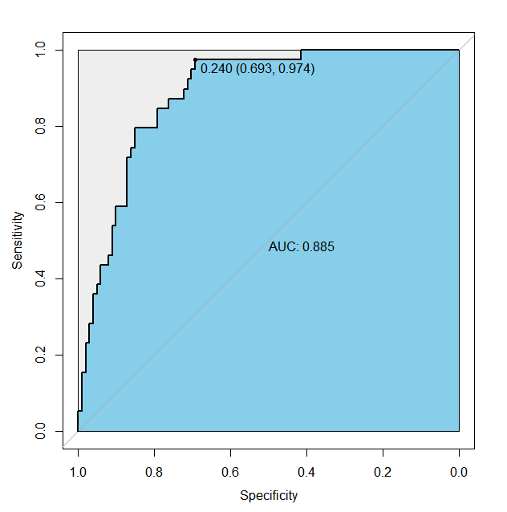

## 逻辑回归模型--glm

### 1. 检查数据基本信息

### 2. 检查数据缺失值情况

### 3. 拆分训练集与测试集

	#不放回随机抽样 二八分布
	con<-sample(1:nrow(Data),nrow(Data)*0.8)
	#训练集
	trans<-sample(Data[con,])
	#测试集
	test<-sample(Data[-con,])

### 4. 建模
	
	#违约为本次模型的因变量y （0,1）
	glm <- glm(违约 ~ .,family = binomial(link = logit), data = xunlian)
	
	summary(glm)

---

	Coefficients:
             Estimate Std. Error z value Pr(>|z|)    
	(Intercept) -1.629162   0.710890  -2.292 0.021922 *  
	信用卡负债   0.626542   0.123993   5.053 4.35e-07 ***
	其他负债     0.051847   0.084368   0.615 0.538863    
	地址        -0.095285   0.025975  -3.668 0.000244 ***
	负债率       0.069199   0.034297   2.018 0.043628 *  
	收入        -0.009108   0.008216  -1.109 0.267596    
	工龄        -0.254092   0.036482  -6.965 3.29e-12 ***
	教育         0.144198   0.140308   1.028 0.304080    
	年龄         0.033086   0.019592   1.689 0.091273 .  
	Signif. codes:  0 ‘***’ 0.001 ‘**’ 0.01 ‘*’ 0.05 ‘.’ 0.1 ‘ ’ 1
	---
	(Dispersion parameter for binomial family taken to be 1)

    Null deviance: 638.45  on 559  degrees of freedom
	Residual deviance: 443.37  on 551  degrees of freedom
	AIC: 461.37

	Number of Fisher Scoring iterations: 6

> Estimate Std. Error t value Pr(>|t|)   
> 估值，标准误差，T值，P值  

其中，我们可以直接通过P值与我们预设的0.05进行比较，来判定对应的解释变量的显著性（我们检验的原假设是，该系数是否显著为0，P<0.05则拒绝原假设，即对应的变量显著不为0），我们可以看到** 截距项Intercept和 信用卡负债、地址、负债率、工龄** 都可以认为是在P为0.05的水平下显著不为0，通过显著性检验

###### 1. 拟合不理想 `step()` 逐步选择

	# 逐步寻优法
	logit.step <- step(glm, direction = "both")
	summary(logit.step)
	# 前向选择法
	logit.step <- step(glm, direction = "forward")
	summary(logit.step)
	# 后向选择法
	logit.step <- step(glm, direction = "backward")
	summary(logit.step)

 ---
	
 > 前向选择法：从一元回归开始，逐步增加变量，使指标达到最优  
 > 后向选择法：从全变量回归方程开始，逐步删去某个变量，使指标值达到最优为止  
 > 逐步寻优法：综合上述两种方法 
 > 
 > 最后选择  `AIC` 最小的一组最为最终模型。 
 
###### 2. 监测多重共线性
	library(car)
	vif(glm)
* 方差膨胀因子（Variance Inflation Factor，VIF）：是指解释变量之间存在多重共线性时的方差与不存在多重共线性时的方差之比。容忍度的倒数，VIF越大，显示共线性越严重。经验判断方法表明：当0<VIF<10，不存在多重共线性；当10≤VIF<100，存在较强的多重共线性；当VIF≥100，存在严重多重共线性。

 1. 完全共线性下参数估计量不存在
 2. 近似共线性下OLS估计量非有效
 3. 参数估计量经济含义不合理
 4. 参数估计量经济含义不合理
 5. 模型的预测功能失效。变大的方差容易使区间预测的“区间”变大，使预测失去意义。
    
### 5. 预测
	library(pROC)
	pre<-predict(glm,test,type = "response")
* 预测值为概率，则type = response 给出具体的预测概率，而 type = class按规定的阙值给出分类  
* 以0.5默认阈值查看 0 ，1 结果  `ifelse(pre>0.5,1,0)`
 
### 6. ROC曲线确定最优阈值 
	
	modelroc<-roc(test$违约,pre)  
	plot(modelroc,print.auc=TRUE,auc.polygon=TRUE,auc.polygon.col="skyblue",print.thres=TRUE, max.auc.polygon=TRUE)

 	

### 7. 对比检测

	result<-ifelse(pre>0.5,1,0)
	table(test$违约,result)

---
	   result
	     0  1
	  0 91 10
	  1 17 22

精确率   

* TP/(TP+FP)
* 90/(91+10)=0.90
 
召回率

 * TP/(TP+FN)
 * 90/(91+17)=0.83

#### END
* 数据示例    

			    年龄 教育 工龄 地址 收入 负债率 信用卡负债 其他负债 违约
		1     41    3   17   12  176    9.3      11.36     5.01    1
		2     27    1   10    6   31   17.3       1.36     4.00    0
		3     40    1   15   14   55    5.5       0.86     2.17    0
		4     41    1   15   14  120    2.9       2.66     0.82    0
		5     24    2    2    0   28   17.3       1.79     3.06    1
		6     41    2    5    5   25   10.2       0.39     2.16    0
		7     39    1   20    9   67   30.6       3.83    16.67    0
		8     43    1   12   11   38    3.6       0.13     1.24    0
		9     24    1    3    4   19   24.4       1.36     3.28    1
		10    36    1    0   13   25   19.7       2.78     2.15    0
		11    27    1    0    1   16    1.7       0.18     0.09    0
		12    25    1    4    0   23    5.2       0.25     0.94    0
		13    52    1   24   14   64   10.0       3.93     2.47    0
		14    37    1    6    9   29   16.3       1.72     3.01    0
		15    48    1   22   15  100    9.1       3.70     5.40    0
		16    36    2    9    6   49    8.6       0.82     3.40    1	
				