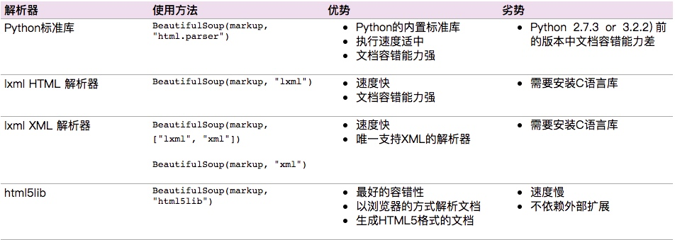

## 数据提取的几种方式
---

### 一、正则表达式

#### 1. 语法规则

* 单个字符

	`.` 用来匹配除了换行符以外的任意**单个**字符 。
	
	`\d` 匹配单个数字
	
	`\w` 匹配单个字符 ，在ASCII码中等价于 _\[a-zA-Z0-9_\]_ ，在Unicode中则更加匹配内容更加广泛
	
	`\s` 匹配单个空白字符，包含space、tab以及换行符等
	
	`\b` 匹配单词边界
	
	`[abc]` 匹配范围内的单个字符串，这个例子可以匹配a、b或者c；这个例子也可以表示为`[a-c]`
	
	`^` 匹配开头
	
	`$` 匹配结尾 ，_如果开始拥有权力，必然最后获得金钱_。

* 多个字符
	
	`?` 重复0次或者1次 ；
	
	`*` 重复0次以上 ； 重复0次，说明前面的字符可以不存在。
	
	`+` 重复1次以上 。
	
	`{n}` 重复n次；
	
	`{n,m}` 重复n到m次
	
	如果上限没有指定，也就是m置空，则表示字符串重复n次及以上。 注意上面的规则都是添加到前一个字符上的，如果是希望匹配重复的字符串，就是使用到`( )`符号，其后跟随数值限定表达式，例如`(test){1,3}`就可以匹配`test`、`testtest`以及`testtesttest` 字符串。
	
	`( )` 还有一个重要的作用来表示捕获组（capture group），对于捕获组的内容有两种引用方式，一个是在正则表达式外部引用，另一个就是在内部引用，后者也常被称为反向引用。

* 反向引用

	反向引用是用来**识别重复模式**的，例如经常说到ABAB模式，就是AB的重复。包含反向参考的正则表达式有如下特征：`(xxx)\number` ，其中的number用来指代正则表达式中第几个捕获组，捕获组序号从1开始。
	
	理论上太过于抽象， 通过例子看会更加清晰。 `(\w+)\s+\1` 这个表达式可以识别连续的重复单词，例如`go go`等，利用的就是反向引用，利用`\1`来表示表示`(\w+)`所匹配到的内容，同样多个分组也是可以匹配上的，`(\w+)\s+(\w+)\s+\1\s+\2` 可以识别出`go here go here`这样的模式。

* 标识符

	上述已经构成了一个正则表达式的基本规则，但是在实际使用中会添加几个标识符来实现更便捷的功能。在python中有以下几种方式。多个规则一起使用写做（re.I | re.M）

	 * re.I(全拼：IGNORECASE): 忽略大小写（括号内是完整写法，下同）
	 * re.M(全拼：MULTILINE): 多行模式，改变'^'和'$'的行为（参见上图）
	 * re.S(全拼：DOTALL): 点任意匹配模式，改变'.'的行为
	 * re.L(全拼：LOCALE): 使预定字符类 \w \W \b \B \s \S 取决于当前区域设定
	 * re.U(全拼：UNICODE): 使预定字符类 \w \W \b \B \s \S \d \D 取决于unicode定义的字符属性
	 * re.X(全拼：VERBOSE): 详细模式。这个模式下正则表达式可以是多行，忽略空白字符，并可以加入注释。

#### 2.Python中使用

Python 自带了re模块，它提供了对正则表达式的支持。主要用到的方法列举如下

	#返回pattern对象
	re.compile(string[,flag])  
	#以下为匹配所用函数
	re.match(pattern, string[, flags]) 
	re.search(pattern, string[, flags])
	re.split(pattern, string[, maxsplit])
	re.findall(pattern, string[, flags])
	re.finditer(pattern, string[, flags])
	re.sub(pattern, repl, string[, count])
	re.subn(pattern, repl, string[, count])

pattern可以理解为一个匹配模式，通常写做

	pattern = re.compile(r'(?<=<td>)\d+?(?=</td>)', re.M)

* `match`从字符串开头匹配，匹配到返回match的对象，匹配不到返回None 
* `search`扫描整个字符串返回第一个匹配到的元素并结束，匹配不到返回None
* `split`通过正则表达式将字符串分离。如果用括号将正则表达式括起来，那么匹配的字符串也会被列入到list中返回。maxsplit是分离的次数，maxsplit=1分离一次，默认为0，不限制次数。
* `findall`以列表的形式返回能匹配的子串
* `finditer`搜索string，返回一个顺序访问每一个匹配结果（Match对象）的迭代器。
* `sub` 使用repl替换string中每一个匹配的子串后返回替换后的字符串。 当repl是一个字符串时，可以使用\id或\g<id>、\g<name>引用分组，但不能使用编号0。 当repl是一个方法时，这个方法应当只接受一个参数（Match对象），并返回一个字符串用于替换（返回的字符串中不能再引用分组）。 count用于指定最多替换次数，不指定时全部替换。 
* `subn`函数返回元组

简单案例
	
	import requests
	import re
	user_agent =UserAgent()
	html = requests.get("https://www.xicidaili.com/nn/").text
	
	pattern = re.compile(r'(?<=<td>)\d*\.\d*\.\d*\.\d*(?=</td>)') #获取ip地址
	iplist=re.findall(pattern,html)

#### 3.其他应用
[hive 正则表达式详解](https://blog.csdn.net/bitcarmanlee/article/details/51106726) 在hive中涉及三个函数：_regexp_、_regexp_extract_ 以及 _regexp_replace_

[mysql中replace、regexp正则表达式替换用法](https://blog.csdn.net/andyzhaojianhui/article/details/46650255) 利用replace 配合update子句来实现内容的更新

[12.5.2 Regular Expressions](https://dev.mysql.com/doc/refman/8.0/en/regexp.html) 介绍了MySQL下的regexp的使用方法

### 二、Xpath

#### 1.Xpath语法

* //book[1]/title   #第一个book节点下的标题
* //book/price/text()   #节点下的文本
* //bookstore/book[price>35]/price  # 选取价格高于 35 的所有 price 节点
* //bookstore/book[price>35]/title  # 选取价格高于 35 的所有 title 节点
* //div[@id="ip_list"]/a/@href     #选取链接
* //div[4]/img/@src  #取图片地址
* //@code   #匹配所有带有code属性的属性值
* //div/node() #获取注释

	

#### 2.简单下载&调用
	### 下载 ###
	pip3 install lxml
	### 使用 ###
	from lxml import etree

	content = etree.HTML(html)
	content.xpath('//*[@id="ip_list"]//tr/td[4]/a/text()')

chrome有个工具叫xpath-helper,可以去应用商店下载，这样就可以用这个工具来检查你的xpath语法是否正确了。  
另外如果语法正确，但是在程序中提取不到，查看源代码,因为在浏览器中普遍会对html代码进行优化，在源代码中定位到目标元素中后发现表格中的table元素下没有tbody，是浏览器自动加上去的，还有就是p元素的标签没有闭合，也是浏览器自动补上去的…之后就可以根据原始的html代码而进行查找了。如果还不可以，这时就要考虑原网页是动态页面，需要用到js解析了。

### 二、BeautifulSoup

一个灵活又方便的网页解析库，处理高效，支持多种解析器。

#### 1.解析器

Beautiful Soup支持Python标准库中的HTML解析器,还支持一些第三方的解析器，如果我们不安装它，则 Python 会使用 Python默认的解析器，lxml 解析器更加强大，速度更快，推荐安装。

 

#### 2.Beautifulsoup语法
	
1. 案例

		### 导入 ###
		from bs4 import BeautifulSoup
		
		html = '''
		<html><head><title>The Dormouse's story</title></head>
		<body>
		
<b>The Dormouse's story</b>

		
		
Once upon a time there were three little sisters; and their names were
		<a href="http://example.com/elsie" class="sister" id="link1">Elsie</a>,
		<a href="http://example.com/lacie" class="sister" id="link2">Lacie</aand
		<a href="http://example.com/tillie" class="sister" id="link3">Tillie</a>;
		and they lived at the bottom of a well.

		
...

		'''
		
		### 将网页解析为Beautifulsoup对象 ###
		soup = BeautifulSoup(html,'lxml')
		#### 美化后打印 ####
		print(soup.prettify()) 
		#### 打印出title标签 ####
		print(soup.title)                    
		#### 打印出title标签名字 ####
		print(soup.title.name)
		#### 打印出title标签内字符 ####
		print(soup.title.string)
		#### 打印出title标签的父标签名字 ####
		print(soup.title.parent.name)
		#### 打印出p标签 ####
		print(soup.p)
		#### 打印出p标签class名字 ####
		print(soup.p["class"])
		#### 打印a便签 ####
		print(soup.a)
		### 打印全部a便签，结果为list ###
		print(soup.find_all('a'))
		#### 打印id=link3的标签 ####
		print(soup.find(id='link3'))
	
	-----
		### 输出结果 ###
		<title>The Dormouse's story</title>
		title
		The Dormouse's story
		head
		
<b>The Dormouse's story</b>

		['title']
		<a class="sister" href="http://example.com/elsie" id="link1">Elsie</a>
		[<a class="sister" href="http://example.com/elsie" id="link1">Elsie</a>, <a class="sister" href="http://example.com/lacie" id="link2">Lacie</a>, <a class="sister" href="http://example.com/tillie" id="link3">Tillie</a>]
		<a class="sister" href="http://example.com/tillie" id="link3">Tillie</a>
	
	-----
		for link in soup.find_all('a'):
			### 获取a标签的链接 ###
		    print(link.get('href'))
		### 获取所有内容 ###
		print(soup.get_text())

2. 基本使用
	* `soup.标签名` 我们就可以获得这个标签的内容 返回的结果是第一个标签的内容
	* `soup.title.name`的时候就可以获得该title标签的名称
	* `soup.p['name']`  `soup.p.attrs['name']` 可以获取p标签的name属性值
	* `soup.p.string` 可以获取第一个p标签的内容
	* `soup.head.title.string `  嵌套选择
	* `soup.p.contents` 将p标签下的所有子标签存入到了一个列表中
	* `soup.p.children` 获取p标签下的所有子节点内容和通过contents获取的结果是一样的，但是不同的地方是soup.p.children是一个迭代对象，而不是列表，只能通过循环的方式获取素有的信息
	* `soup.descendants` contents以及children都是获取子节点，如果想要获取子孙节点可以通过descendants，这种获取的结果也是一个迭代器
	* `soup.a.parent`就可以获取父节点的信息
	*   > `soup.a.next_siblings` 获取后面的兄弟节点  
		> `soup.a.previous_siblings` 获取前面的兄弟节点  
		> `soup.a.next_sibling` 获取下一个兄弟标签   
		> `souo.a.previous_sinbling` 获取上一个兄弟标签  

3. 标准选择

	* find_all(name,attrs,recursive,text,**kwargs) 根据标签名，属性，内容查找文档
		* **name**	`soup.find_all('ul')`
		* **attrs**   `soup.find_all(attrs={'name': 'elements'})`  # attrs可以传入字典的方式来查找标签，但是这里有个特殊的就是class,因为class在python中是特殊的字段，所以如果想要查找class相关的可以更改attrs={'class_':'element'}或者soup.find_all('',{"class":"element})，特殊的标签属性可以不写attrs，例如id
		* **text** soup.find_all(text='Foo')  # 结果返回的是查到的所有的text='Foo'的文本

	* find(name,attrs,recursive,text,**kwargs)  返回的匹配结果的第一个元素
		* find_parents() 返回所有祖先节点
		* find_parent() 返回直接父节点。
		* find_next_siblings() 返回后面所有兄弟节点
		* find_next_sibling() 返回后面第一个兄弟节点
		* find_previous_siblings() 返回前面所有兄弟节点
		* find_previous_sibling() 返回前面第一个兄弟节点
		* find_all_next() 返回节点后所有符合条件的节点
		* find_next() 返回第一个符合条件的节点
		* find_all_previous() 返回节点后所有符合条件的节点
		* find_previous() 返回第一个符合条件的节点

4. CSS选择器
	* 通过`select()`直接传入CSS选择器就可以完成选择，熟悉前端的人对CSS可能更加了解，其实用法也是一样的 `.` 表示class；  `#` 表示id
		* soup.select('.panel .panel-heading')
		* soup.select('ul li')
		* soup.select('#list-2 .element')

	* `get_text()` 获取文本内容
		* soup.select('li')[1].get_text()
		
	* `[属性名]或者attrs[属性名] ` 获取属性
		* `ul['id']`
		* `ul.attrs['id']`

