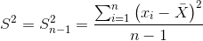

title: 统计学基础（一）
date: 2019-05-01 13:45:17
tags: "统计学"
summary: 对统计学知识进行回顾
cover: true
mathjax: true
categories: "统计学"
---
# 统计学基本知识（一）

此文目的旨在对统计学知识进行回顾

## 样本和总体
-----------------------

*   **总体**：研究对象的整个群体
*   **样本**：从总体中抽取的部分，用于代表总体的整体情况
*   数学符号的区别:  
    总体均值常用 μ，样本均值常用 $\\overline{X}$

### 总体方差

*   **方差**：衡量变量或者一组随机数据离散程度的度量
*   **公式**：  
      
    其中 N 为总体数目

### 样本方差

*   由于很多统计情景下总体的数目无法直接测算，因此常常使用总体中的部分样本来对总体进行估计
*   公式：  
    
    
*   其中 n 为样本数目。值得注意的是，总体的分布并不总是均匀的，如果样本选取的不好，比如样本恰好选择了总体当中数据分布较为集中的部分，所得到样本方差就会很小。在这种情况下，样本方差无法准确反映总体的方差，实际所选取的样本甚至可能并不包括总体均值。这个公式通常会低估总体方差。
    
*   **无偏估计**：也称作无偏样本方差
*   **公式**：  
    
*   通常这个指标更加接近总体方差

### 标准差

*   方差的平方根
*   标准差使得离散程度的估计值恢复跟原始数据一样的量纲

### 诸方差公式

*   **公式**：  
    
    
*   证明过程此处不表，由原总体方差公式平方和展开求解可得。
    

### 期望

*   亦即总体的均值，此处一般指总体无穷的情形。因此在计算平均值时无法像有穷情形下一样，计算通常使用频率来代替，而频率则由概率分布得出。
*   **公式**：  
    

### 概率密度函数

前文所提到的统计量均为离散型数据，此处提出的概念为连续型数据。在连续型数据当中，想要估计变量恰好为某一个精确值的概率几乎是不可能的，这也可以解释为什么在我们的教材当中认为连续型变量当中等于某一固定值的概率为0。因此通常我们在估计概率的时候会允许一定的容差。在此前提下，统计学提出了概率密度函数的概念，以微积分为工具来测算在我们允许的容差范围内某一事件发生的概率，也就是一个抽象概念下的曲线面积——这一曲线就是概率密度函数。注意，所有事件发生的概率之和应当为1，因此曲线总面积也当为1。

二项分布
--------------------

### 一个简单的案例

*   连续抛五次硬币，并计算正面朝上的概率
*   此处涉及排列组合的问题，通过计算可以看出一个神奇的地方，你会发现正面朝上0、1、2、3、4、5次的概率分别与正面朝上5、4、3、2、1、0次的概率一样。这是因为事件硬币正面朝上 n 次等同于事件反面朝上 5 - n 次，而在这个案例中正面朝上的概率与反面朝上的概率恰好相等。
*   总结可得公式如下：

*   其中 N 是试验的次数，p 是事件A发生的概率，1-p 则是事件A的互斥事件发生的概率。二项式系数表示每次独立事件可能发生的所有情形。

### 二项分布的期望值

*   公式：  
    
*   **证明**：  
    核心点在于通过期望的计算公式提取出 np 项，通过换元把剩余部分转化为二项分布概率之和即为1。

### 泊松过程

*   假设 X 为一小时内通过的车辆，假设期望值的最好估计值是 λ \\lambdaλ 。则这个过程可以近似为60分钟内有多少车辆经过——这样便可以近似地看作一个二项分布。但是实际上一分钟很有可能通过不止一辆车，则这个时候可以选取更小的细分区间来近似：秒、毫秒…不断地重复这一过程，得到的结果就是泊松过程。

### 泊松分布

*   **公式**：  
    
    
*   **证明**：  
    本质上是使用二项分布的公式进行计算，但是二项分布公式中的试验次数 N 此时趋近于无穷大。
    

### 大数定理

*   **核心思想**：样本数量足够大的时候，样本均值将趋近于总体均值

### 正态分布

*   **公式**：  
    
*   均值会影响分布曲线的中心位置，而标准差则会影响分布曲线的陡峭程度。
*   与二项分布不同的是，正态分布不能只看某一点的概率，所以应该看某一区间内曲线下的面积，即特定区间下的积分值。
*   **CDF函数**：累积分布函数。通过不同上限的累积分布函数值相减可得对应区间的概率。

### 标准正态分布

均值为0，标准差为1的正态分布

### Z分数

*   离均值有多少个标准差远

### 经验法则

*   均值一个标准差区间：68%
*   均值两个标准差区间：95%
*   均值三个标准差区间：99.7%
