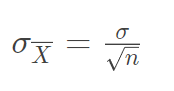

# 统计学基本知识（二）

此文目的旨在对统计学知识进行回顾
中心极限定理
------

*   任何具有良好定义的具有均值与标准差的分布，随机取出 m 组样本量为 n 的样本。只要样本量 n 足够大，这些样本的均值就收敛于正态分布。

样本均值的抽样分布
---------

*   即原分布的抽样所得均值形成的分布

### 偏度

*   正偏态分布：右侧尾部较长
*   负偏态分布：左侧尾部较长

### 峰度

*   正峰态：曲线更陡峭，尾部较长
*   负峰态：曲线更平缓，尾部较短

**抽样样本容量越大，抽样分布均值形成的分布就越趋近于正态分布，标准差越小，曲线越紧凑**

均值标准误差
------

*   抽样分布均值的分布标准差
*   **公式**：   

**上面所提到的基础信息可以帮助我们在分布未知的情形下，利用中心极限定理来计算概率。具体步骤为：**

*   根据中心极限定理可知，在样本量足够大的前提下，**原分布总体均值可近似等同于抽样分布总体均值**，并通过样本量与总体标准差计算出均值标准误差
*   计算 Z-分数，并通过查表确认偏离中心的距离，从而确定概率。**注意**分数表中特定的Z-分数值对应的概率为左开右闭区间

伯努利分布
-----

*   又名 0-1 分布，是一个离散型分布。
*   统计量：
    *   μ = p
    *   σ^2 = p ( 1-p )

置信区间
----

*   即以概率 p 成立的误差区间。与之相对应的是置信水平，常常取值0.05。
*   从均值标准误差的公式可以看出，抽样样本量越大，对应的标准差越小。则在同样的置信水平下，误差区间就越小，得到的估计值就越精确。例如在前面的学习当中，我们可以得知在样本均值落在两个标准差区间内的概率约为95%，此时若提高样本量，则标准差变小，估计值所在的范围也就越小，自然就越精确。

小结
--

*   在计算概率时，要理清样本均值、总体均值、抽样分布均值三者的关系。
    *   样本均值是从总体中抽样所得样本的均值，样本的标准差也只是对总体的一个估计值，不完全相等
    *   在样本量足够大的前提下，抽样分布均值趋近于总体均值
    *   同样的置信水平下，可以通过增加样本量来提高准确度
