统计学基础（四）

1.线性回归
======

1.1 基础概念
--------

二变量数据：对于每一个观察结果，二变量数据给出两个变量数值

常用表示图形：散点图（散布图），散点图的作用在于能体现数据的实际模式，通过散点图，你可以清晰地看出两个变量的关系

正线性相关：x增长，y也涨

负线性相关：x增长，y下降

不相关：x和y数值呈现一种随机模式

两个变量之间存在相关关系（数学关系），并不一定意味着一个变量会影响另一个变量，也不意味着二者存在实际关系

最佳拟合线：能最好的接近所有数据点的线（最佳预测）

如果确定最佳拟合线：表达式为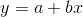  
且使得y的实际观察值与每个x相对应的y的估计值的差距最小的线

如何确定差距最小：利用误差平方和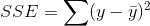  ，和方差的计算方法很相近

1.2 拟合线计算步骤
-----------

*   求出 $\\overline{x}$和 $\\overline{y}$
*   计算y = a+bx中的斜率（陡度） b ，即 b 为最佳拟合线的斜率，公式为：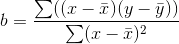
*   最佳拟合线最好穿过x和y的均值 $\\overline{x}$ ，$\\overline{y}$，带入计算计算 a = $\\overline{y}$ - b$\\overline{x}$
*   得到最佳拟合线

> 最小二乘法
> 
> 一种数学方法，可以用一条最佳拟合线将一组二变量数据拟合
> 
> 通过将公式 y = a + bx 的一条直线与一组数值相拟合，使得误差平方和最小——即使得实际数值与这些数值的估计值之间的差值最小。
> 
> 其中，直线 y = a + bx 被称为**回归线**

1.3 判断准确性
---------

利用回归线的相关性强度——相关系数

相关系数介于 -1 和 1 之间，描述了各个数据点与直线的偏离程度，度量回归线与数据的拟合度，用字母 r 表示

*  r=-1，数据为完全负线性相关；
*  r=1，完全正线性相关；
*  r=0，不存在相关性

> 计算相关系数r
> 
> 计算公式：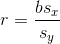 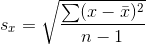 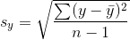 
> 
> 其中 $s_x$ 是样本中的x值的标准差，$s_y$

2\. 方差分析**（Analysis of Variance，简称ANOVA）**
==========================================

2.1 定义
------

一个假设检验过程，用于评估两个或者多个处理（总体）的平均数的差异，也可以说，方差分析和t检验只是做相同工作的两种不同的方法。

2.2 方差分析举例分析
------------

某饮料生产企业研制出一种新型饮料。饮料的颜色共有四种，分别为橘黄色、粉色、绿色和无色透明。这四种饮料的营养含量、味道、价格、包装等可能影响销售量的因素全部相同，先从地理位置相似、经营规模相仿的五家超级市场上收集了前一期该种饮料的销售量情况，见表

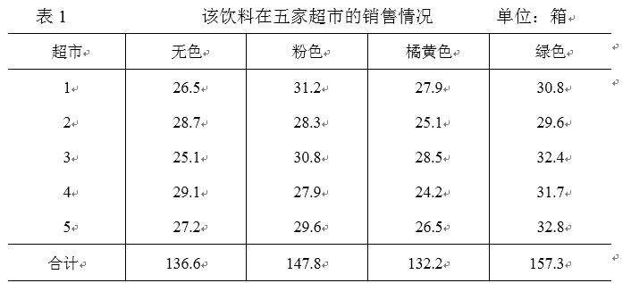

### 2.2.1 方差分析术语

*   因素：因素是一个独立的变量，也就是方差分析研究的对象，也称为因子。如：例1中，我们要分析饮料的颜色对饮料的销售量是否有影响，在这里，“饮料的颜色”是所要检验的对象，它就是一个因素。在有的书中把因素称为“因子”。
*   水平因素中的内容称为水平，它是因素的具体表现。如：例1中“饮料的颜色”这一因素中的水平有四个，即饮料的四种不同颜色：无色、粉色、桔黄色、绿色；它们是“饮料的颜色”这一因素的四种具体表现。 因素的每一个水平可以看作是一个总体，比如：无色、粉色、桔黄色、绿色饮料可以看作是四个总体。
*   控制变量在方差分析中，能够人为控制的影响因素称为控制因素，或控制变量；如：例1中，“饮料的颜色”对于饮料的销售量而言，是能够人为控制的影响因素，称为控制变量。
*   随机变量在方差分析中，人为很难控制的影响因素称为随机因素，或随机变量；如：例1中，“人们对不同颜色的偏爱”对于饮料的销售量而言，是人为很难控制的影响因素，称为随机变量。
*   观察变量与观察值 在方差分析中，受控制因素和随机因素影响的事物，称为观察变量。在每个水平下得到的样本数据称为观察值。如：例1中，销售量是观察变量，在每个饮料颜色下得到的样本数据（即表10－1中的数据）就是观察值。

### 2.2.2 方差分析的原理

从方差分析的目的来看，是要检验各个水平的均值μ1、μ2、…、μm是否相等（m为水平个数），而实现这个目的的手段是通过方差的比较（即考察各观察数据的差异）。 在变量的观察值之间存在着差异。差异的产生来自于两个方面。

一个方面是由因素中的不同水平造成的，称之为系统性差异（或系统性误差）。如：饮料的不同颜色带来不同的销售量。

另一个方面是由于抽选样本的随机性而产生的差异，称之为随机性差异（或随机性误差）。如：相同颜色的饮料在不同的商场销售量也不同。 两个方面产生的差异可以用两个方差来计量。

一个叫**组间方差**，即水平之间的方差，是衡量不同总体下各样本之间差异的方差。在组间方差里，既包括系统性误差，也包括随机性误差。如：在例1中，不同颜色的饮料在不同地点（超市）产品销售量之间的差异既有系统性误差（即由于人们对不同颜色的偏爱造成的差异），也有随机性误差（即由于抽样的随机性造成的差异）。不同颜色的饮料在不同地点（超市）产品销售量之间的方差即为组间方差。

另一个叫**组内方差**，即水平内部的方差，是衡量同一个总体下样本数据的方差。在组内方差里仅包括随机性差异。如：在例1中，可以把同一个颜色的饮料在不同地点（超市）产品销售量之间的差异看成是随机因素的影响，同一个颜色的饮料在不同地点（超市）产品销售量之间的方差即为组内方差。

如果不同的水平对结果没有影响，如: 饮料的不同颜色对销售量无影响，那么在水平之间的方差中，就仅仅有随机因素影响的差异，而没有系统性因素影响的差异。这样一来，组间方差与组内方差就应该非常接近，两个方差的比值就会接近于1；反之，如果饮料的不同颜色对销售量有影响，在组间方差中就不仅包括了随机性误差，也包括了系统性误差，这时，组间方差就会大于组内方差，两个方差的比值就会大于1。当这个比值大到某种程度时，我们就可以作出判断，说不同水平之间存在着显著性差异。一次，方差分析就是通过不同方差的比较，作出接受原假设或拒绝原假设的判断。如：例子中，判断饮料的不同颜色对销售量是否有显著性影响的问题，实际上也就是检验销售量的差异主要是由于什么原因所引起的。如果这种差异主要是系统性误差，我们就说饮料的不同颜色对销售量有显著性影响。

### 2.2.3 方差分析思路

从表中看到，20个数据各不相同，其原因可能有两个方面：   

*   一是销售地点不同的影响。即使是相同颜色的饮料，在不同超市的销售量也是不同的。但是，由于这五个超市地理位置相似、经营规模相仿，因此，可以把不同地点产品销售量的差异看成是随机因素的影响。
*   二是饮料颜色不同的影响。即使在同一个超市里，不同颜色的饮料的销售量也是不同的。哪怕它们的营养成分、味道、价格、包装等方面的因素都相同，但销售量也不相同。这种不同，有可能是由于抽样的随机性造成的，也有可能是由于人们对不同颜色的偏爱造成的。

于是，上述问题就归结为检验饮料颜色对销售量是否有影响的问题。我们可以令μ1、μ2、μ3、μ4分别为四种颜色饮料的平均销售量，检验它们是否相等。如果检验结果显示μ1、μ2、μ3、μ4不相等，则意味着不同颜色的饮料来自于不同的总体，表明饮料颜色对销售量有影响；反之，如果检验结果显示μ1、μ2、μ3、μ4之间不存在显著性差异，则意味着不同颜色的饮料来自于相同的总体，可认为饮料颜色对销售量没有影响。

### 2.2.4 计算分析

*   建立假设

原假设： $H_0$ ：$μ_1$ = $μ_2$ = $μ_3$ = $μ_4$ ；即假设颜色对销售量没有影响。

备则假设： $H_1$ ：$μ_1$ 、 $μ_2$ 、 $μ_3$ 、 $μ_4$ 不全相等，即假设四个配方颜色对销售量有影响。

*   计算水平均值

无色饮料销售量均值＝136.6÷5＝27.32箱

粉色饮料销售量均值＝147.8÷5＝29.56箱

桔黄色饮料销售量均值＝132.2÷5＝26.44箱

绿色饮料销售量均值＝157.3÷5＝31.46箱

*   计算全部观察值的总均值

各种颜色饮料销售量总的样本平均数＝(136.6+147.8+132.2+157.3)÷20＝28.695箱

*   计算离差平方和

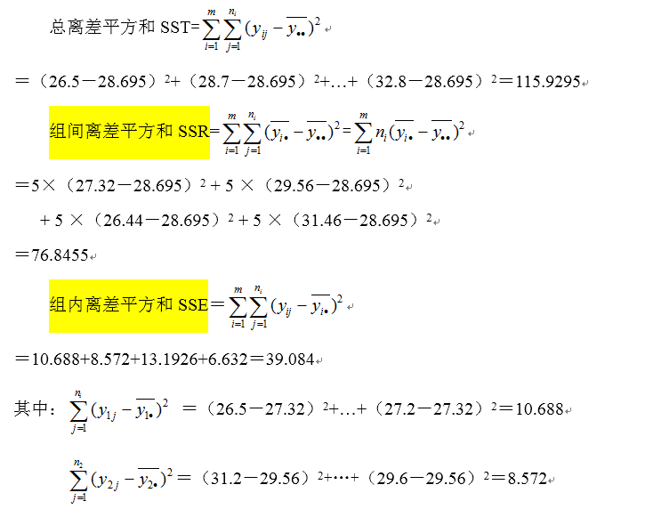

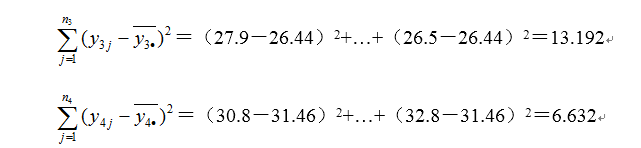

*   构造统计量并计算检验统计量的样本值  

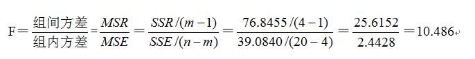

*   确定检验规则、列出方差分析表、做出统计决策 P-值规则

根据算得的检验统计量的样本值（F值）算出P-值＝0.000466。由于P-值＝0.000466＜显著水平标准=0.05,所以拒绝H0，接受备择假设H1,即通过检验知，μj不全相等，说明饮料的颜色对销售量有显著影响。

### 2.2.5 结论

**临界值规则**：根据给定的显著水平a＝0.05，查表得临界值为3.24。因为F＝10.486＞3.24，检验统计量的样本值落入拒绝域，所以拒绝H0,接受备择假设H1,即通过检验知，μj不全相等，说明饮料的颜色对销售量有显著影响。

**p值大于显著水平，支持原假设，F值大于临界值（由显著水平得到），拒绝原假设。**

3\. 卡方分布（$χ^2$）
====================================================================================

3.1 定义
------

$χ^2$分布，这种分布通过一个检验统计量来比较期望结果和实际结果之间的差别，然后得出观察频数极值的发生概率。

3.2 $χ^2$分布的两个主要用途
-------------------------------------------------------------------------------------

*   检验拟合优度：也就是可以检验一组给定的数据与指定分布的吻合程度。
*   检验两个变量独立性：通过这个方法可以检查变量之间是否存在着某种关联

3.3 计算步骤
--------

### 3.3.1 确定要进行检验的假设及备选假设

### 3.3.2 求出期望频数和自由度

$χ^2$分布用到一个参数——希腊字母 ν ，读作“纽”

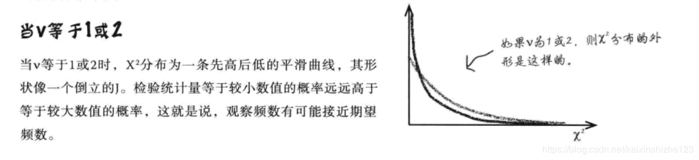

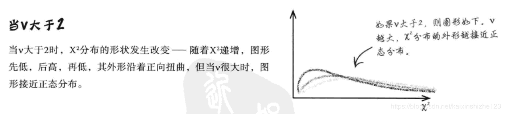

** ν 表示自由度** ν 为自由度数据，及用于计算检验统计量（$χ^2$）的独立变量的数目，或可以说是独立信息段的数目。

自由度数目等于我们要计算的期望频数的数目——计算式要考虑我们所受到的各种限制，

 ν = 我们所计算过信息的数目（组数） \- 限制（期望频数综合 = 观察频数总和）数

几种常见概率分布的自由度：

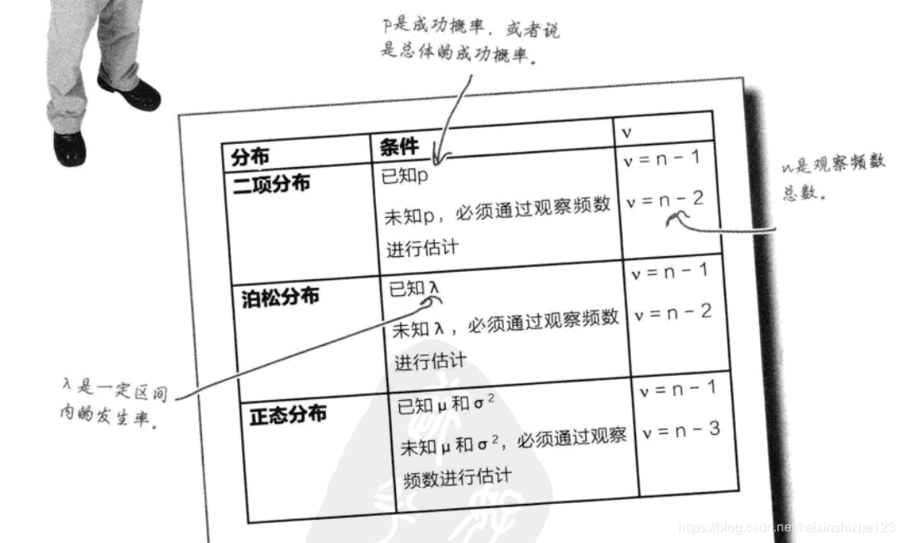

### 3.3.3 确定用于决策拒绝域

### 3.3.4 计算检验统计量$χ^2$

用观察频数和期望频数计算下列统计量。

$χ^2$ =$\sum$ $\frac{(O-E)^2}{E}$

其中O代表观察频数，E代表期望频数。

对于概率分布的每一个概率，取期望频数和实际频数的差，求差的平方数，再除以期望频数，然后将所有结果相加

### 3.3.5 查看检验统计量是否位于拒绝域以内

如用过显著性水平 α 进行检验，则可以写作

$χ^2_α$(ν)  

$χ^2$分布的拒绝域，可以通过使用$χ^2$概率表来得到

### 3.3.6 做出决策

---

4.因果性和相关性
=======

*   存在因果关系则一定相关，但存在相关关系并不一定因果

5.演绎推理
====

*   归纳推理：用已有信息进行趋势外推，趋势不一定继续；例如根据历史数据推测人口模式
*   演绎推理：从事实出发演绎得到另一个事实，但知道事实肯定正确；例如解方程
