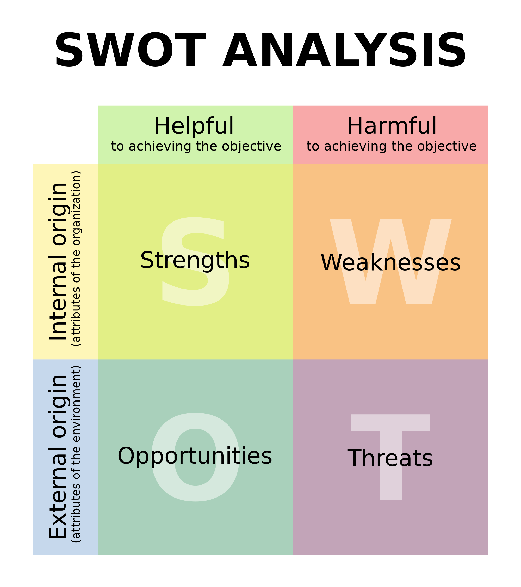
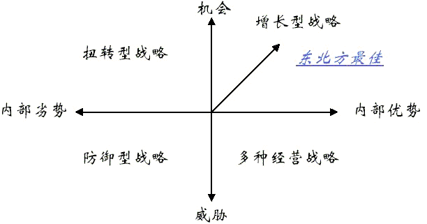
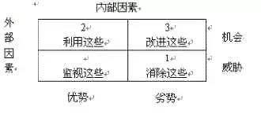
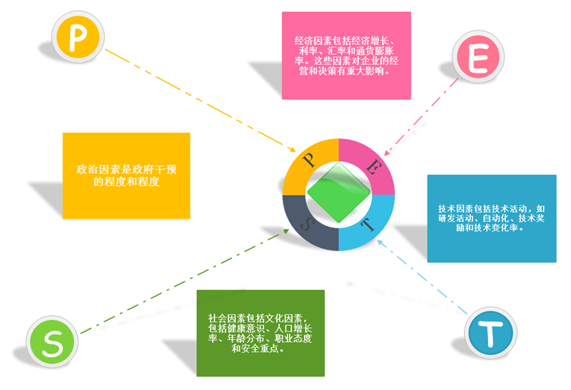
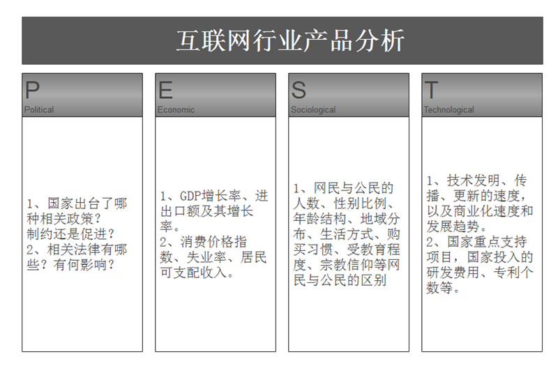
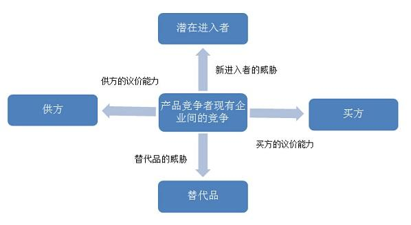

## 三大分析法—SWOT、PEST、波特五力

> 大部分行业中的企业，相互之间的利益都是紧密联系在一起的，作为企业整体战略一部分的各企业竞争战略，其目标都在于使得自己的企业获得相对于竞争对手的优势，所以，在实施中就必然会产生冲突与对抗现象，这些冲突与对抗就构成了现有企业之间的竞争。现有企业之间的竞争常常表现在价格、广告、产品介绍、售后服务等方面，其竞争强度与许多因素有关。

### SWOT分析法

「SWOT分析模型简介」

（也称TOWS分析法、道斯矩阵）。在现在的战略规划报告里，SWOT分析应该算是一个众所周知的工具。来自于麦肯锡咨询公司的SWOT分析，包括分析企业的优势（Strengths）、劣势（Weaknesses）、机会（Opportunities）和威胁（Threats）。因此，SWOT分析实际上是将对企业内外部条件各方面内容进行综合和概括，进而分析组织的优劣势、面临的机会和威胁的一种方法。

  

通过SWOT分析，可以帮助企业把资源和行动聚集在自己的强项和有最多机会的地方；并让企业的战略变得明朗。

  

  

**「SWOT模型含义介绍」**

优劣势分析主要是着眼于企业自身的实力及其与竞争对手的比较，而机会和威胁分析将注意力放在外部环境的变化及对企业的可能影响上。在分析时，应把所有的内部因素（即优劣势）集中在一起，然后用外部的力量来对这些因素进行评估。

  

1.机会与威胁分析（environmental opportunities and threats）

环境发展趋势分为两大类：一类表示环境威胁，另一类表示环境机会。环境威胁指的是环境中一种不利的发展趋势所形成的挑战，如果不采取果断的战略行为，这种不利趋势将导致公司的竞争地位受到削弱。环境机会就是对公司行为富有吸引力的领域，在这一领域中，该公司将拥有竞争优势。

  

对环境的分析也可以有不同的角度。比如，一种简明扼要的方法就是PEST分析，另外一种比较常见的方法就是波特的五力分析。

  

2、 优势与劣势分析（Strengths and weaknesses）

由于企业是一个整体，而且竞争性优势来源十分广泛，所以，在做优劣势分析时必须从整个价值链的每个环节上，将企业与竞争对手做详细的对比。如产品是否新颖，制造工艺是否复杂，销售渠道是否畅通，以及价格是否具有竞争性等。如果一个企业在某一方面或几个方面的优势正是该行业企业应具备的关键成功要素，那么，该企业的综合竞争优势也许就强一些。需要指出的是，衡量一个企业及其产品是否具有竞争优势，只能站在现有潜在用户角度上，而不是站在企业的角度上。

  

企业在维持竞争优势过程中，必须深刻认识自身的资源和能力，采取适当的措施。因为一个企业一旦在某一方面具有了竞争优势，势必会吸引到竞争对手的注意。一般地说，企业经过一段时期的努力，建立起某种竞争优势;然后就处于维持这种竞争优势的态势，竞争对手开始逐渐做出反应;而后，如果竞争对手直接进攻企业的优势所在，或采取其它更为有力的策略，就会使这种优势受到削弱。

  

而影响企业竞争优势的持续时间，主要的是三个关键因素：

1\. 建立这种优势要多长时间?

2\. 能够获得的优势有多大？

3\. 竞争对手做出有力反应需要多长时间？

  

**「SWOT分析步骤」**

1、 确认当前的战略是什么？

2、 确认企业外部环境的变化（波特五力或者PEST）

3、 根据企业资源组合情况，确认企业的关键能力和关键限制。

4、 按照通用矩阵或类似的方式打分评价

  

把识别出的所有优势分成两组，分的时候以两个原则为基础：它们是与行业中潜在的机会有关，还是与潜在的威胁有关。用同样的办法把所有的劣势分成两组，一组与机会有关，另一组与威胁有关。

  

5、将结果在SWOT分析图上定位

  

  

或者用SWOT分析表，将刚才的优势和劣势按机会和威胁分别填入表格。

  

6、 战略分析

成功应用SWOT分析法的简单规则：

进行SWOT分析的时候必须对公司的优势与劣势有客观的认识；

进行SWOT分析的时候必须区分公司的现状与前景；

进行SWOT分析的时候必须考虑全面。

进行SWOT分析的时候必须与竞争对手进行比较，比如优于或是劣于你的竞争对手；

保持SWOT分析法的简洁化，避免复杂化与过度分析；

SWOT分析法因人而异。

  

一旦使用SWOT分析法决定了关键问题，也就确定是市场营销的目标。SWOT分析法可与PEST analysis和Porter’s Five-Forces analysis等工具一起使用。运用SWOT分析法的时候，要将不用的要素列入相关的表格当中去，很容易操作。

  

针对SWOT中的机会部分，可以用PEST进行分析得到系统的结果。

针对SWOT中的威胁部分，可以用五力分析模型来得到系统的分析结果。

  

### PEST分析法

PEST是从政治（Politics）、经济（Economic）、社会（Society）、技术（Technology）四个方面，基于公司战略的眼光来分析企业外部宏观环境的一种方法。公司战略的制定离不开宏观环境，而PEST分析法能从各个方面比较好的把握宏观环境的现状及变化的趋势，有利于企业对生存发展的机会加以利用，对环境可能带来的威胁及早发现避开。

  

  

要想提高商品的销量，少不了要做产品分析，只有了解了用户的需求，知道用户要什么，才能根据这些数据更好的进行产品优化和活动推广。说到分析方法，可能有些人第一个想到的就是SWOT，这种分析方法主要是能帮助企业找出自身优势，整合资源，从而形成企业的战略规划，如果想要更加深入了解产品分析的话，最好还是用PEST分析法。

  

**PEST分析的内容**

一、政治环境，是指一个国家或地区的政治制度、体制、方针政策、法律法规等方面。这些因素常常影响着企业的经营行为，尤其是对企业长期的投资行为有着较大影响。

二、经济环境，指企业在制定战略过程中须考虑的国内外经济条件、宏观经济政策、经济发展水平等多种因素

三、社会环境，主要指组织所在社会中成员的民族特征、文化传统、价值观念、宗教信仰、教育水平以及风俗习惯等因素。

四、 技术环境，是指企业业务所涉及国家和地区的技术水平、技术政策、新产品开发能力以及技术发展的动态等。

  

  

### 波特五力模型

五力分析模型是迈克尔·波特(Michael Porter)于80年代初提出，对企业战略制定产生全球性的深远影响。用于竞争战略的分析，可以有效的分析客户的竞争环境。五力分别是： 供应商的议价能力、购买者的议价能力、潜在竞争者进入的能力、替代品的替代能力、行业内竞争者现在的竞争能力。五种力量的不同组合变化最终影响行业利润潜力变化。

  

  

五力模型

供应商的议价能力

供方主要通过其提高投入要素价格与降低单位价值质量的能力，来影响行业中现有企业的盈利能力与产品竞争力。

  

购买者的议价能力

购买者主要通过其压价与要求提供较高的产品或服务质量的能力，来影响行业中现有企业的盈利能力。

  

新进入者的威胁

新进入者在给行业带来新生产能力、新资源的同时，将希望在已被现有企业瓜分完毕的市场中赢得一席之地，这就有可能会与现有企业发生原材料与市场份额的竞争，最终导致行业中现有企业盈利水平降低，严重的话还有可能危及这些企业的生存。竞争性进入威胁的严重程度取决于两方面的因素，这就是进入新领域的障碍大小与预期现有企业对于进入者的反应情况。

  

替代品的威胁

两个处于同行业或不同行业中的企业，可能会由于所生产的产品是互为替代品，从而在它们之间产生相互竞争行为，这种源自于替代品的竞争会以各种形式影响行业中现有企业的竞争战略。

  

同业竞争者的竞争程度

大部分行业中的企业，相互之间的利益都是紧密联系在一起的，作为企业整体战略一部分的各企业竞争战略，其目标都在于使得自己的企业获得相对于竞争对手的优势，所以，在实施中就必然会产生冲突与对抗现象，这些冲突与对抗就构成了现有企业之间的竞争。现有企业之间的竞争常常表现在价格、广告、产品介绍、售后服务等方面，其竞争强度与许多因素有关。

  

局限性

五力模型的前提假设是

1.能够清晰的界定行业边界，行业的规模是固定的。

但现实中企业之间往往不是通过吃掉对手而是与对手共同做大行业的蛋糕来获取更大的资源和市场。同时，市场可以通过不断的开发和创新来增大容量。

2.同行业之间只有竞争关系，没有合作关系。

但现实中企业之间存在多种合作关系，不一定是你死我活的竞争关系。

3.能搜集到一切有效信息（信息透明），制定战略者需要了解整个行业的信息。

**来源：知乎**